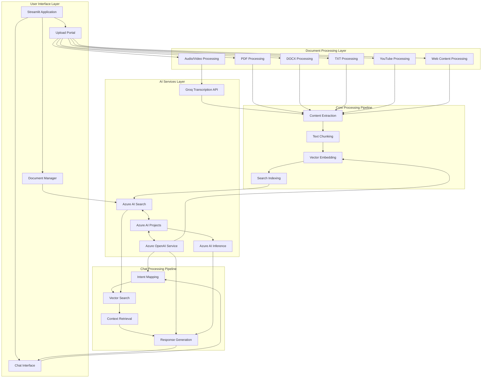
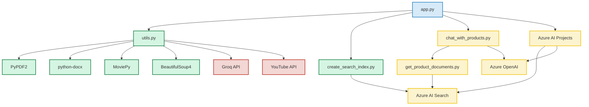
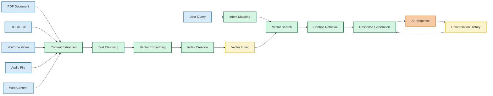
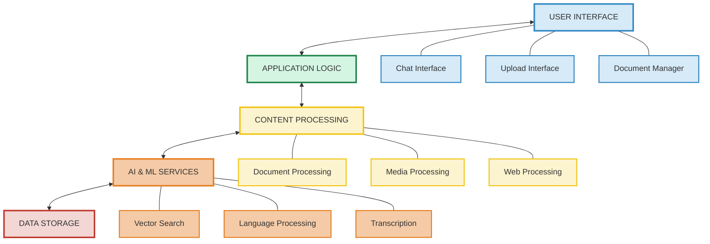
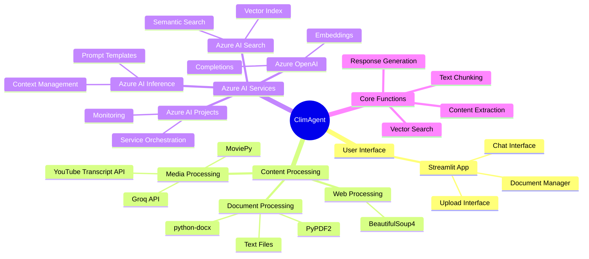

# ClimAgent 🧠

ClimAgent is an innovative AI-powered agent designed for the Microsoft AI Agents Hackathon 2025 that transforms how users interact with various content types. Our solution enables seamless conversations with documents, videos, web content, and more through an intuitive chat interface, leveraging Azure AI services to deliver contextually accurate responses grounded in uploaded content.

## 🏆 Hackathon Project Overview

**Team:** Chemotronix  
**Event:** Microsoft AI Agents Hackathon 2025  

Our project directly addresses the challenge of enabling users to have meaningful conversations with diverse media content. By combining state-of-the-art Azure AI services with a thoughtfully designed user experience, ClimAgent transforms passive content into active knowledge sources that users can query using natural language.

## 🎯 Problem Statement

Knowledge workers waste countless hours searching through documents, videos, and web pages to find specific information. Traditional search approaches:
- Only find keywords, not answer complex questions
- Cannot connect information across multiple sources
- Don't understand the natural way humans ask questions
- Require users to read entire documents to extract insights

## 💡 Our Solution

ClimAgent creates an AI agent that:
- Acts as a knowledgeable assistant for any uploaded content
- Understands questions in natural language and provides precise answers
- Grounds all responses in the actual content to ensure accuracy
- Supports virtually any content format through a unified processing pipeline
- Maintains conversational context for complex multi-turn interactions

**[Watch Our Demo Video](https://www.youtube.com/watch?v=jOhebgsUKwQ)** (5 minutes) to see ClimAgent in action!

## 🌟 Key Features & Innovation

- **Universal Content Understanding**: Process and interact with:
  - Documents (PDF, DOCX, TXT) with full semantic understanding
  - Video content (MP4, MKV, MOV) through audio transcription
  - Audio files (MP3, WAV) with advanced speech-to-text
  - YouTube video transcripts for educational content
  - Web page content with automatic extraction

- **Intelligent Interaction**:
  - Natural, conversational interface with memory of previous questions
  - Dynamic intent mapping to understand complex queries
  - Context-aware responses grounded in uploaded content
  - Citation of specific sources for transparency and trust

- **Human-in-the-Loop Capabilities**:
  - User feedback collection for response quality
  - Content library management through intuitive UI
  - Ability to correct or guide the AI agent's understanding
  - User control over which documents to include in the knowledge base

- **Responsible AI Implementation**:
  - Transparency in showing source material for responses
  - Clear indication when answers are speculative vs. factual
  - Privacy-preserving local processing for sensitive documents
  - User control over data retention and processing

## 🧩 Azure AI Services Integration

Our solution deeply integrates with the Azure AI ecosystem:

- **Azure AI Search**: Powers our RAG (Retrieval Augmented Generation) system
  - Custom vector search implementation with HNSW algorithm
  - Semantic hybrid search combining vector and keyword approaches
  - Optimized chunking strategy with 100-token overlaps for context preservation

- **Azure AI Projects**: Orchestrates our AI components
  - Manages component interactions and dependencies
  - Simplifies deployment and configuration
  - Enables comprehensive monitoring and telemetry

- **Azure AI Inference**: Provides advanced language understanding
  - Handles complex query interpretation
  - Generates contextually aware completions
  - Processes inputs with semantic understanding

- **Azure OpenAI Service**: Delivers powerful language capabilities
  - Embedding generation for vector search (text-embedding-3-large)
  - Intent mapping for query optimization (gpt-4o)
  - Response generation with citation awareness (gpt-4o)

- **Azure Monitor OpenTelemetry**: Ensures system reliability
  - End-to-end tracing of request processing
  - Performance monitoring for optimization
  - Error detection and reporting

## 📊 Technical Architecture

At the heart of ClimAgent lies a sophisticated architecture designed to transform static content into interactive knowledge. Let's explore how the different components work together to create a seamless experience.

### System Overview
The complete system architecture shows how information flows from user input through processing pipelines to intelligent responses:



This holistic view demonstrates how our system integrates user interfaces, document processing, core processing pipelines, AI services, and chat interaction in a cohesive ecosystem.

### Content Flow & Processing Pipeline

Our architecture implements two primary pipelines that power the ClimAgent experience:

#### 1. Content Ingestion and Processing
```
User Upload → Content Extraction → Text Chunking → Vector Embedding → Azure AI Search Indexing
```
When users upload content, it undergoes a series of transformations - from raw documents into semantically meaningful chunks that are embedded and indexed for rapid retrieval.

#### 2. Conversational AI Pipeline
```
User Query → Intent Mapping → Vector Search → Context Retrieval → Grounded Response Generation → User Feedback
```
User questions are analyzed for intent, then matched against our vector database to find relevant content, which serves as the foundation for generating accurate, grounded responses.

### Component Relationships Diagram
The interconnections between our codebase and external services reveal the elegant modularity of ClimAgent:



This diagram exposes the architectural blueprint of ClimAgent, showing how various code files form the foundation of our system. The application core (app.py) orchestrates everything, connecting to specialized modules for content processing (utils.py), search indexing (create_search_index.py), and chat functionality (chat_with_products.py). External services like Azure AI and content processing libraries are seamlessly integrated through well-defined interfaces.

### Data Flow Visualization
Following the journey of information through the system provides insights into ClimAgent's intelligence:



This visualization tracks how content transforms as it moves through ClimAgent. Documents, videos, and web content enter the system and undergo extraction, chunking, and embedding before being stored in our vector index. When users ask questions, their queries follow a parallel path of intent mapping and vector search, ultimately retrieving the right context to generate meaningful responses. The conversation history ensures continuity and relevance across interactions.

### 3D Layered Architecture
ClimAgent's architecture can also be understood as a stack of specialized layers that work together:



The layered view reveals the clean separation of concerns in our architecture. The user interface layer provides intuitive access points, while the application logic coordinates the underlying processes. The content processing layer handles diverse media formats, feeding into the AI services layer that powers our intelligent responses. Everything is anchored by the storage layer that maintains the knowledge base and conversation context.

### Technology Interconnections Map
The mind map below showcases the rich ecosystem of technologies that power ClimAgent:



This hierarchical representation illustrates how we've integrated best-in-class technologies across the stack. From Streamlit for the frontend to PyPDF2 and MoviePy for content processing, and from Azure AI Search for retrieval to Azure OpenAI for language understanding, each component was carefully selected to create a seamless, intelligent experience.

### Key Technical Components:

The architectural foundation of ClimAgent is built on these sophisticated components:

- **Chunking Engine**: Intelligently splits documents while preserving context and semantic meaning across sections, ensuring that related information stays connected.

- **Vector Database**: Leverages high-dimensional embeddings (1536 dimensions) to store semantic representations of content, enabling similarity-based retrieval that understands meaning beyond keywords.

- **LLM Orchestration**: Manages the complex prompt engineering required to elicit coherent, accurate responses from large language models, with specialized templates for different tasks.

- **Context Management**: Maintains a dynamic conversation state that evolves as users interact with the system, enabling follow-up questions and clarifications.

- **Media Processing Pipeline**: Transforms diverse content types through specialized extractors, creating a unified text representation that can be processed uniformly regardless of the original format.

## 💻 User Experience & Real-World Impact

ClimAgent addresses real-world scenarios for:

- **Researchers** who need to quickly extract insights from academic papers
- **Students** seeking to understand and interact with educational content
- **Knowledge workers** who reference large technical documentation
- **Legal professionals** who need to extract specific clauses from contracts
- **Content creators** who want to make their content more accessible

Our user interface is designed for intuitive interaction:
- **Chat Interface**: Clean, responsive design for natural conversation
- **Upload Portal**: Simple drag-and-drop functionality for any media type
- **Document Management**: Easy organization of knowledge sources
- **Feedback Mechanism**: Built-in ways to improve AI responses

## 🚀 Getting Started

### Prerequisites

- Python 3.8+
- Azure account with access to AI services
- Required API keys (detailed in setup instructions)

### Installation

1. Clone the repository:
   ```bash
   git clone <repository-url>
   cd ClimAgent
   ```

2. Install required dependencies:
   ```bash
   pip install -r requirements.txt
   ```

3. Create a `.env` file with your API keys:
   ```
   AIPROJECT_CONNECTION_STRING=<Your Azure AI Project connection string>
   AISEARCH_INDEX_NAME=<Your Azure AI Search index name>
   INTENT_MAPPING_MODEL=<Model for intent mapping, e.g. gpt-4o>
   EMBEDDINGS_MODEL=<Model for embeddings, e.g. text-embedding-3-large>
   CHAT_MODEL=<Model for chat completions, e.g. gpt-4o>
   GROQ_API_KEY=<Your Groq API key>
   OPENAI_API_KEY=<Your OpenAI API key>
   ```

4. Launch the application:
   ```bash
   streamlit run app.py
   ```

## 📋 Code Quality & Implementation Highlights

Our implementation goes far beyond sample code, with sophisticated features:

- **Advanced Prompt Engineering**: Carefully crafted prompts in the `assets/` folder
  - Intent mapping optimization for better search queries
  - Grounded generation to prevent hallucinations
  
- **Chunking Strategy**: Intelligent document segmentation
  - Semantic chunking that respects document structure
  - Overlap management for context preservation
  - Metadata enrichment for improved retrieval

- **Error Handling**: Robust implementation for reliability
  - Graceful degradation when services are unavailable
  - Comprehensive logging for debugging
  - User-friendly error messages

- **Security Considerations**:
  - Proper handling of sensitive API keys via .env
  - Input validation to prevent injection attacks
  - No permanent storage of user content unless explicitly requested

## 🔍 Project Structure

```
ClimAgent/
├── app.py                 # Main Streamlit application
├── chat_with_products.py  # Core chat functionality
├── config.py              # Configuration management
├── create_search_index.py # Azure AI Search integration
├── get_product_documents.py # Document retrieval logic
├── utils.py               # Utility functions for content processing
└── assets/                # Prompt templates and evaluation data
    ├── grounded_chat.prompty     # LLM prompt for chat responses
    ├── intent_mapping.prompty    # LLM prompt for query understanding
    └── chat_eval_data.jsonl      # Evaluation dataset
```

## 🔮 Future Development Roadmap

- **Short-term Enhancements** (1-3 months):
  - Multi-language support for global accessibility
  - PDF layout analysis for better understanding of tables and diagrams
  - Advanced search filters for more precise retrieval

- **Medium-term Features** (3-6 months):
  - Integration with Microsoft 365 for direct document access
  - Custom fine-tuning of embeddings for domain-specific knowledge
  - Collaborative knowledge bases for team environments

- **Long-term Vision** (6+ months):
  - Multimodal understanding of images and charts within documents
  - Automated knowledge graph construction from document collections
  - Domain-specific versions for legal, medical, and technical fields

## 🧪 Technical Challenges Overcome

Our team tackled significant technical hurdles:

- **Vector Search Optimization**: Fine-tuned search parameters to balance speed and accuracy
- **Contextual Awareness**: Implemented sophisticated prompt engineering to maintain conversation context
- **Media Processing Pipeline**: Created a unified system for handling diverse content types
- **Grounding Mechanism**: Developed techniques to ensure responses are based only on actual content
- **Real-time UI**: Engineered a responsive interface that handles large document processing smoothly

## 📝 License

This project is licensed under the MIT License - see the [LICENSE](LICENSE) file for details.

## 👥 Team Members

- Victor Olufemi(Copyright holder)
- Peace Bello
- Temitope Olatunji
- Joshua Akintemi
- Bolu Jemiriye

---

Made with 💚 by Chemotronix!

*This project was developed for the Microsoft AI Agents Hackathon 2025. All rights reserved.*
